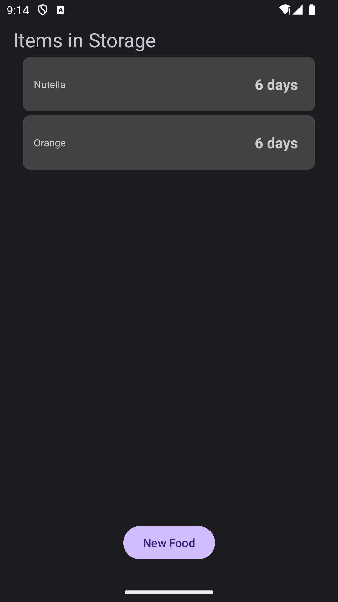
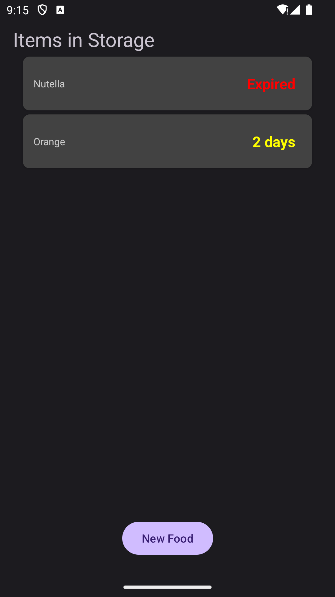
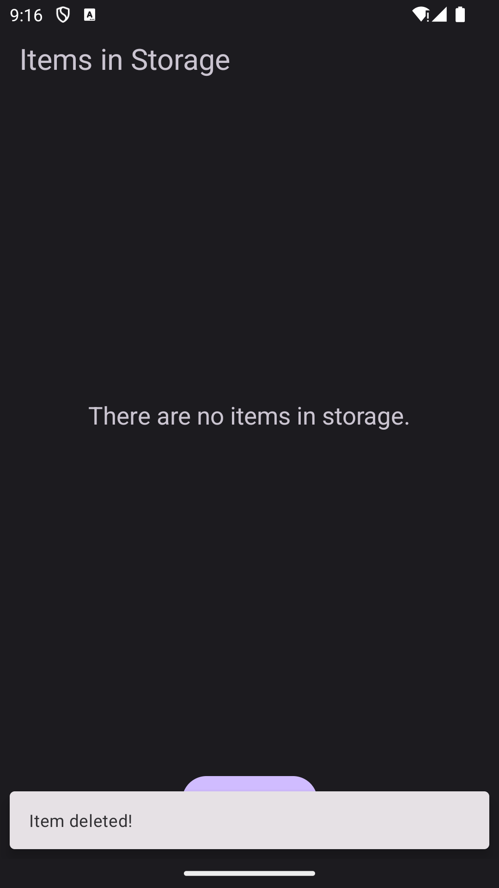
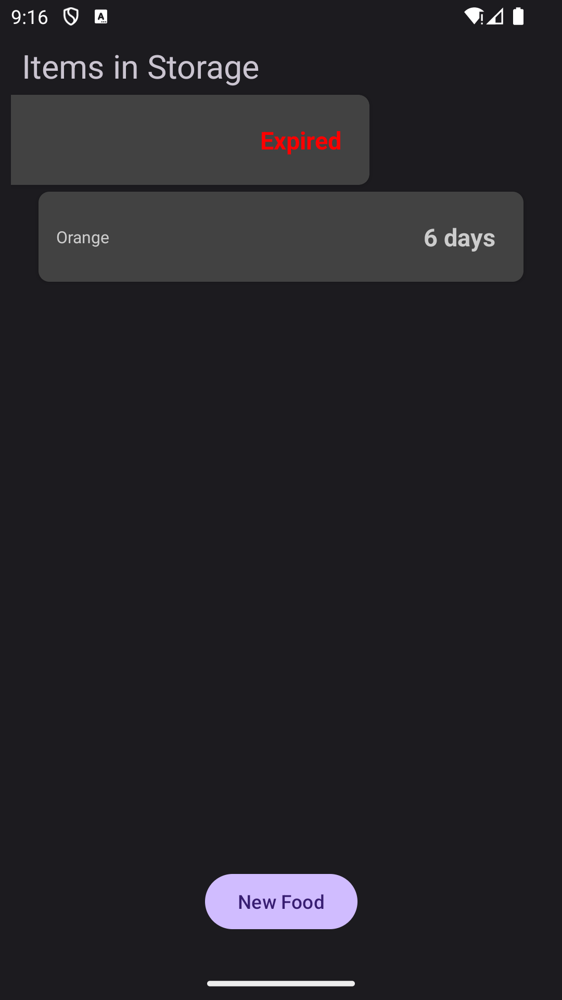
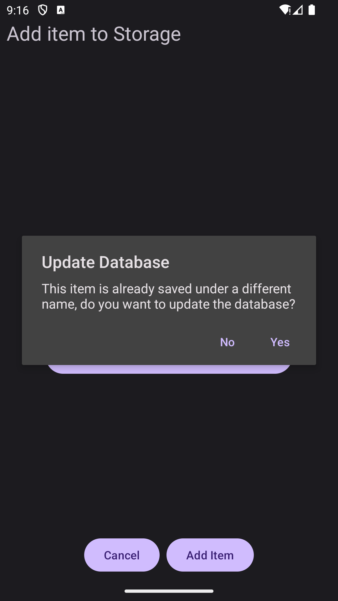
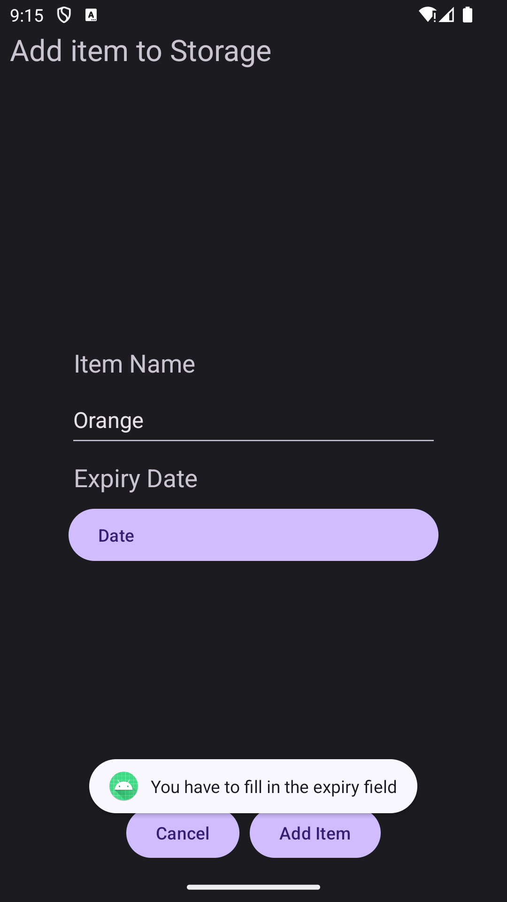
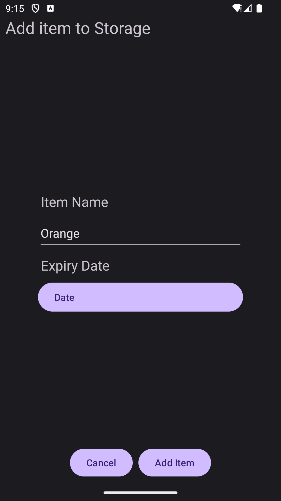
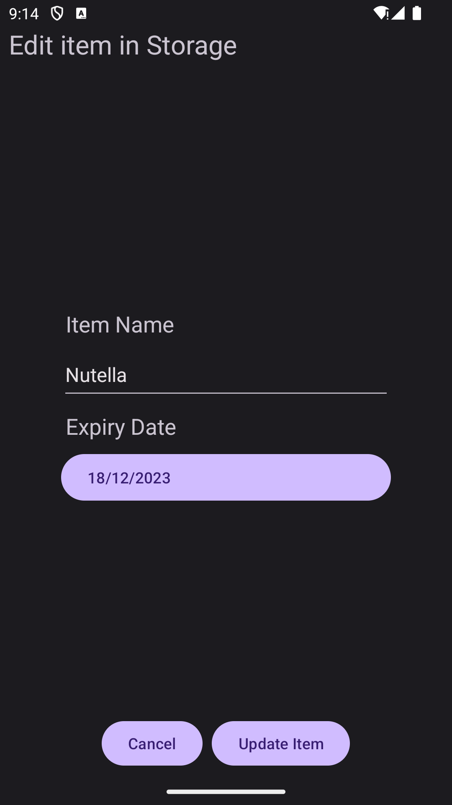
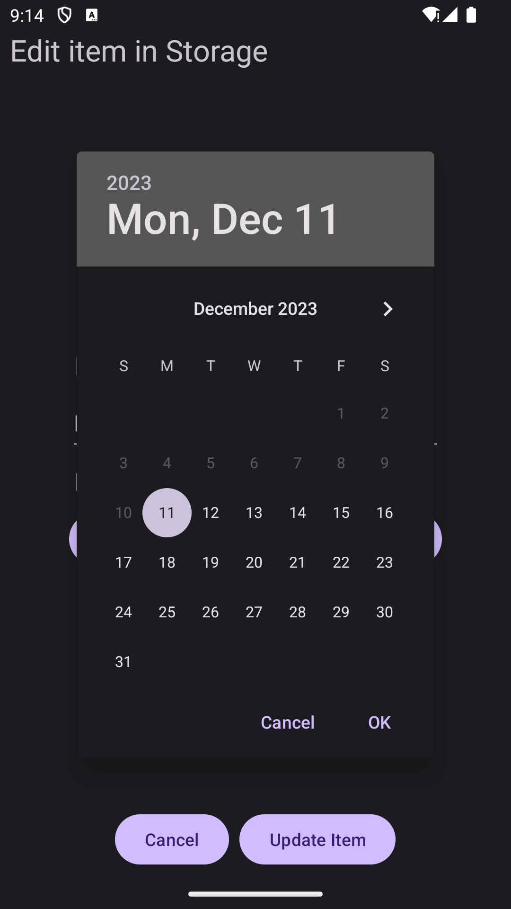
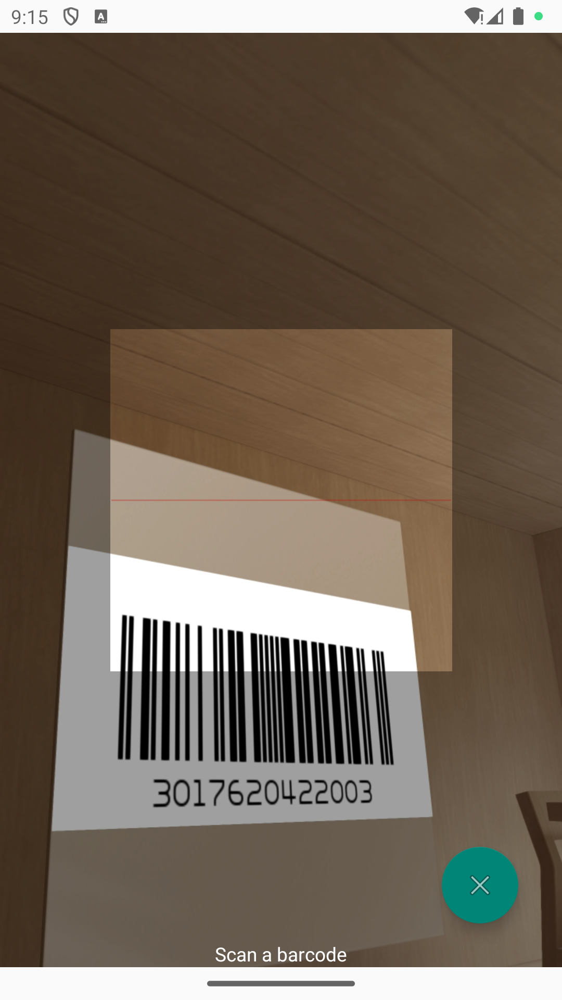

# Fridge App
The Fridge App is an Android application developed in Java, providing a convenient solution for managing food items. The app encompasses various features to enhance user experience and facilitate efficient food tracking.

## Functionality

### Food Logging with Barcode Scanning
Users can log food items by simply scanning barcodes.
The app leverages barcode scanning functionality to identify and log food products.

### Expiry Countdown
Each food item includes a countdown indicating the number of days remaining until its expiry.
This feature assists users in monitoring the freshness of their stored items.

### Swipe to Delete, Click to Edit
The app supports intuitive interactions for managing food items.
Users can swipe horizontally to delete items and click on them to access editing options, allowing for quick and easy customisation.

### Database Integration
The application features a robust database system that saves food items based on unique barcodes.
If a barcode is rescanned, the app auto-fills the associated item's name, streamlining the logging process.

## Activities Overview

### Main Activity

  
  
  
  

The central hub of the application, displaying a list of current storage items.
If the storage is empty, a prompt notifies the user.
Interaction options include swiping items to delete and clicking on items to edit.
The "Create New Food" button initiates the food logging process.

### CreateNewFoodItem Activity

  
  
  

This activity is dedicated to logging new food entries.
Users input the expiry date and item name, and the app saves the information, returning the user to the main activity.

### UpdateFoodItem Activity

  
  
  

Users can update existing food entries by clicking on a record in the main activity.
The update activity allows modification of expiry dates or item names, saving changes and returning the user to the main activity.

### BarcodeScanner Activity

  

This activity utilises a barcode scanner to scan food items.
Scanned items are saved in the database, and users are directed to the CreateNewFoodItem activity for further details.

The Fridge App offers an intuitive and efficient solution for managing food items, combining barcode scanning, database functionality, and user-friendly interfaces.
